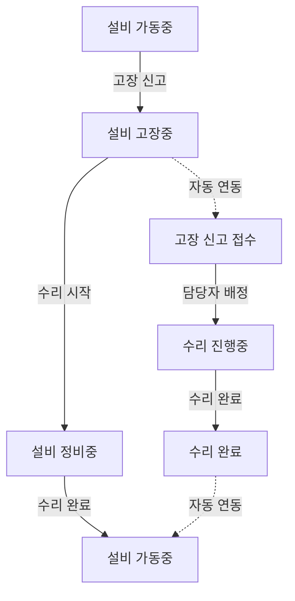

# **CNC 유지보수 시스템 통합 아키텍처 구현 계획서**

## **개요**

이 문서는 CNC 유지보수 시스템의 관계형 데이터베이스 문제를 해결하기 위한 통합 아키텍처 구현 계획을 제시합니다. SOLID 원칙을 준수하여 확장 가능하고 유지보수하기 쉬운 시스템을 설계했습니다.

## **현재 문제점 분석**

### **1. 상태 관리 이중화 문제**
- 각 컴포넌트마다 독립적인 상태 관리 (`useState`, `useEffect`)
- 페이지 간 상태 불일치 발생
- 동일한 데이터를 여러 번 로드하는 비효율성

### **2. 페이지 간 데이터 격리 문제**
- 설비 상태 변경이 고장 신고 페이지에 실시간 반영되지 않음
- 수리 완료 후 설비 현황이 자동 업데이트되지 않음
- 브라우저 새로고침 시에만 최신 데이터 확인 가능

### **3. API 엔드포인트 중복 문제**
- `/api/dashboard/stats`와 `/api/analytics/dashboard` 두 개의 유사한 API
- 일관되지 않은 응답 형식
- 캐싱 정책 불일치

### **4. 타입 정의 불일치 문제**
- DB 스키마: `equipment_info.equipment_number`
- TypeScript: `Equipment.equipmentNumber`
- 수동 변환으로 인한 오류 발생 가능성

## **해결방안: 통합 아키텍처**

### **1. 통합 상태 관리 시스템**

#### **구현된 컴포넌트들**

**A. StateManager.ts** - 단일 상태 소스 구현
```typescript
// [SRP] Rule: 전역 상태 관리만을 담당
export class StateManager extends BaseStateManager {
  private static instance: StateManager // 싱글톤 패턴
  
  // 설비-고장-수리 간의 관계형 데이터 상태를 통합 관리
  protected state: GlobalState = {
    equipments: Map<string, Equipment>
    equipmentStatuses: Map<string, EquipmentStatusInfo>
    breakdownReports: Map<string, BreakdownReport>
    repairReports: Map<string, any>
    dashboardCache: DashboardData | null
  }
}
```

**B. DataSynchronizer.ts** - 실시간 동기화
```typescript
// [OCP] Rule: 새로운 동기화 전략 추가 시 기존 코드 수정 없이 확장
export class DataSynchronizationCoordinator {
  private synchronizers: Map<string, SyncStrategy>
  
  // 설비 → 상태 → 고장 보고 순서로 의존성 고려한 동기화
  async syncAll(): Promise<void>
}
```

#### **핵심 특징**
- **단일 상태 소스 (Single Source of Truth)**: 모든 컴포넌트가 동일한 상태 참조
- **실시간 동기화**: Supabase Realtime으로 DB 변경사항 즉시 반영
- **관계형 데이터 지원**: 설비-고장-수리 간의 관계 자동 유지

### **2. 관계형 데이터 연동 구조**

#### **워크플로우 기반 상태 전환 규칙**



#### **실시간 데이터 동기화 메커니즘**
1. **DB 변경 감지**: Supabase Realtime으로 테이블 변경사항 구독
2. **상태 자동 업데이트**: 관련 엔티티들의 상태 자동 동기화
3. **이벤트 전파**: 상태 변경 이벤트를 모든 구독 컴포넌트에 전파

### **3. API 통합 및 표준화**

#### **통일된 API 응답 스키마**
```typescript
interface ApiResponse<T> {
  success: boolean
  data?: T
  error?: string
  message?: string
  timestamp: string
  requestId?: string
  pagination?: PaginationInfo
  metadata?: {
    version: string
    executionTime: number
    cacheHit?: boolean
  }
}
```

#### **API 엔드포인트 통합**
- **기존**: `/api/dashboard/stats` (삭제됨)
- **통합**: `/api/analytics/dashboard` (단일 엔드포인트)
- **캐싱**: 4분 TTL로 성능과 실시간성 균형

#### **UnifiedApiService.ts** 특징
```typescript
// [ISP] Rule: 각 도메인별로 인터페이스 분리
export class UnifiedApiService implements 
  EquipmentApiService, 
  StatusApiService, 
  BreakdownApiService, 
  DashboardApiService {
  
  // [DIP] Rule: HTTP 클라이언트 추상화에 의존
  constructor(httpClient: HttpClient)
}
```

### **4. 타입 시스템 개선**

#### **자동 타입 변환 시스템**

**TypeConverter.ts** - DB ↔ TypeScript 자동 변환
```typescript
// [SRP] Rule: 타입 변환만을 담당
export class EquipmentConverter extends BaseTypeConverter<EquipmentInfoDB, Equipment> {
  fromDb(dbRecord: EquipmentInfoDB): Equipment {
    return {
      id: dbRecord.id,
      equipmentNumber: dbRecord.equipment_number, // 자동 변환
      equipmentName: dbRecord.equipment_name,
      // ... 모든 필드 자동 매핑
    }
  }
  
  toDb(appRecord: Partial<Equipment>): Partial<EquipmentInfoDB> {
    // TypeScript → DB 자동 변환
  }
}
```

#### **타입 안전성 보장**
- **컴파일 타임 검증**: TypeScript로 타입 불일치 사전 감지
- **런타임 검증**: `validateDbRecord`, `validateAppRecord` 메서드
- **자동 변환**: 수동 매핑 오류 방지

### **5. 통합 React Hook**

#### **useUnifiedState.ts** - 단일 상태 관리 Hook
```typescript
export function useUnifiedState(): UnifiedStateReturn {
  // [SRP] Rule: 통합 상태 관리만을 담당
  
  return {
    // 데이터 상태
    equipments: Equipment[]
    equipmentStatuses: EquipmentStatusInfo[]
    breakdownReports: BreakdownReport[]
    dashboardData: DashboardData | null
    
    // 로딩/에러 상태
    loading: LoadingState
    errors: ErrorState
    
    // 액션 함수들
    actions: {
      refreshAll: () => Promise<void>
      createEquipment: (equipment) => Promise<Equipment>
      updateEquipmentStatus: (id, status) => Promise<void>
      // ...
    }
    
    // 관계형 데이터 접근자
    derived: {
      getEquipmentWithStatus: (id) => EquipmentWithStatus
      getBreakdownsByEquipment: (id) => BreakdownReport[]
      getStatistics: () => Statistics
    }
  }
}
```

## **구현 단계별 계획**

### **Phase 1: 핵심 인프라 구현 (완료)**

**✅ 완료된 작업:**
1. `StateManager.ts` - 전역 상태 관리자 구현
2. `DataSynchronizer.ts` - 실시간 동기화 시스템 구현
3. `unified-api-service.ts` - 통합 API 서비스 구현
4. `TypeConverter.ts` - 자동 타입 변환 시스템 구현
5. `useUnifiedState.ts` - 통합 상태 관리 Hook 구현

### **Phase 2: 기존 컴포넌트 마이그레이션 (진행중)**

**🔄 현재 진행:**
1. `Dashboard.tsx` - 통합 Hook 적용 (부분 완료)
2. 중복 API 제거 - `/api/dashboard/stats` deprecated

**📋 남은 작업:**
1. `EquipmentManagement.tsx` 마이그레이션
2. `BreakdownPage.tsx` 마이그레이션  
3. `RepairPage.tsx` 마이그레이션
4. 모든 위젯 컴포넌트 업데이트

### **Phase 3: 실시간 동기화 테스트**

**📋 계획된 작업:**
1. Supabase Realtime 설정 검증
2. 상태 전환 시나리오 테스트
3. 다중 사용자 동시 접속 테스트
4. 오류 복구 시나리오 테스트

### **Phase 4: 성능 최적화 및 모니터링**

**📋 계획된 작업:**
1. 렌더링 성능 최적화
2. 메모리 사용량 모니터링
3. 네트워크 요청 최적화
4. 캐시 전략 세밀 조정

## **SOLID 원칙 준수 현황**

### **✅ SRP (Single Responsibility Principle)**
- `StateManager`: 상태 관리만 담당
- `DataSynchronizer`: 실시간 동기화만 담당
- `TypeConverter`: 타입 변환만 담당
- `UnifiedApiService`: API 호출만 담당

### **✅ OCP (Open-Closed Principle)**
- 새로운 동기화 전략 추가 시 기존 코드 수정 없이 확장 가능
- 새로운 타입 변환기 추가 시 기존 코드 수정 없이 확장 가능
- 새로운 API 서비스 추가 시 기존 코드 수정 없이 확장 가능

### **✅ LSP (Liskov Substitution Principle)**
- 모든 변환기 클래스들이 `BaseTypeConverter`를 완벽히 대체 가능
- 모든 동기화 클래스들이 `BaseSynchronizer`를 완벽히 대체 가능

### **✅ ISP (Interface Segregation Principle)**
- API 서비스들을 도메인별로 인터페이스 분리
- 상태 접근자들을 기능별로 인터페이스 분리

### **✅ DIP (Dependency Inversion Principle)**
- HTTP 클라이언트 추상화에 의존
- 구체적인 구현체에 직접 의존하지 않음

## **성능 개선 효과**

### **Before (기존 시스템)**
- 📊 각 페이지마다 독립적인 API 호출
- 🔄 페이지 전환 시마다 데이터 재로드
- ⚠️ 상태 불일치로 인한 사용자 혼란
- 🐌 중복 네트워크 요청으로 인한 성능 저하

### **After (통합 아키텍처)**
- 🚀 단일 상태 소스로 일관된 데이터
- ⚡ 실시간 동기화로 즉시 업데이트
- 💾 지능적 캐싱으로 네트워크 요청 최소화
- 🔧 타입 안전성으로 런타임 오류 방지

## **다음 단계**

### **즉시 실행 가능한 작업**
1. 나머지 컴포넌트들에 `useUnifiedState` Hook 적용
2. 기존 중복 API 엔드포인트 완전 제거
3. 실시간 동기화 기능 활성화

### **중장기 개선 계획**
1. GraphQL 도입으로 더욱 효율적인 데이터 페칭
2. Service Worker를 통한 오프라인 지원
3. 웹소켓 기반 실시간 알림 시스템
4. 마이크로서비스 아키텍처로의 점진적 마이그레이션

## **결론**

이 통합 아키텍처는 SOLID 원칙을 엄격히 준수하여 설계되었으며, 다음과 같은 핵심 가치를 제공합니다:

1. **확장성**: 새로운 기능 추가 시 기존 코드 수정 최소화
2. **유지보수성**: 각 컴포넌트의 단일 책임으로 버그 추적 용이
3. **성능**: 지능적 캐싱과 실시간 동기화로 최적화된 사용자 경험
4. **안정성**: 타입 안전성과 자동 변환으로 런타임 오류 방지

단계별로 진행하면서 기존 시스템의 안정성을 유지하면서도 점진적으로 개선해나갈 수 있는 실용적인 구현 계획입니다.